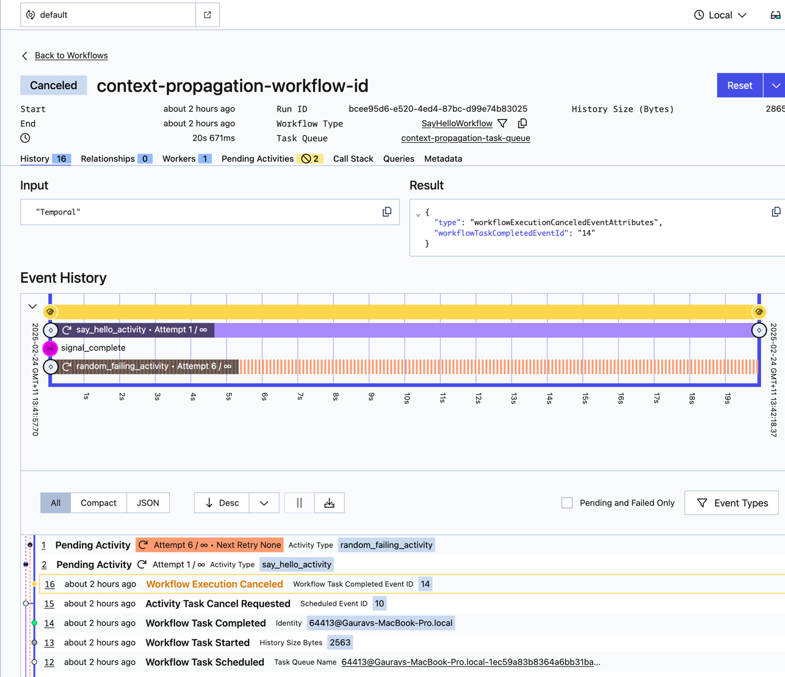

# Temporal Python SDK Samples

This is built from from a set of samples to include

- interceptor - Context Propagation Interceptor Sample
- encryption - data converter + codec server
- couple of activities
  - 1 constantly failing 

to try replicate the issue 

## Usage

Prerequisites:

* Python >= 3.9
* [Poetry](https://python-poetry.org)
* [Temporal CLI installed](https://docs.temporal.io/cli#install)
* [Local Temporal server running](https://docs.temporal.io/cli/server#start-dev)

With this repository cloned, run the following at the root of the directory:

    poetry install

That loads all required dependencies. Then to run a sample, usually you just run it in Python. For example:

Run worker
```bash
  poetry run python context_propagation/worker.py \
    --target-host us-east-1.aws.api.temporal.io:7233 \
    --api-key $(cat /Users/gauravthadani/Work/Code/src/github.com/gauravthadani/temporal-template/api_key) \
    --namespace gaurav-test.a2dd6
```

Run activity worker
```bash
  poetry run python context_propagation/activity_worker.py \
    --target-host us-east-1.aws.api.temporal.io:7233 \
    --api-key $(cat /Users/gauravthadani/Work/Code/src/github.com/gauravthadani/temporal-template/api_key) \
    --namespace gaurav-test.a2dd6
```

Run starter
```bash
    poetry run python context_propagation/starter.py \
    --target-host us-east-1.aws.api.temporal.io:7233 \
    --api-key $(cat /Users/gauravthadani/Work/Code/src/github.com/gauravthadani/temporal-template/api_key) \
    --namespace gaurav-test.a2dd6
```

Run codec server

```bash
  poetry run python context_propagation/codec_server.py
```



