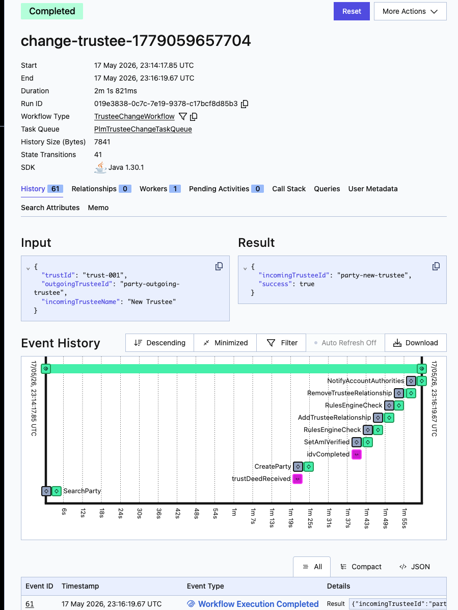

# PLM Trustee Change

Single-workflow sample for the PLM(O) trustee change use case.

## Run

1. Start a local Temporal server:
   ```
   temporal server start-dev
   ```

2. In one terminal, run the worker:
   ```
   ./gradlew :core:execute -PmainClass=io.temporal.samples.plm.Worker
   ```

3. In another terminal, run the starter (kicks off the workflow and exits):
   ```
   ./gradlew :core:execute -PmainClass=io.temporal.samples.plm.Starter
   ```

4. Open the Web UI at http://localhost:8233 to see the execution and event history.

   

## Drive the workflow via CLI

The workflow pauses waiting for two signals. Send them with the `temporal` CLI (substitute the workflow ID printed by the starter):

```
temporal workflow signal \
  --workflow-id <workflow-id> \
  --name trustDeedReceived \
  --input '"deed://trust-001/2026-05-18"'

temporal workflow signal \
  --workflow-id <workflow-id> \
  --name idvCompleted \
  --input 'true'
```

`--input` is JSON: strings are quoted (`'"..."'`), booleans are bare.

## Query mid-flight

While the workflow is running, query the current result:

```
temporal workflow query --workflow-id <workflow-id> --type getCurrentResult
```

`incomingPartyId` is populated once the new trustee is identified/onboarded; `success` flips to `true` only after the final notify.

## Layout

- `TrusteeChangeWorkflow` — workflow interface + signals + request/result records
- `TrusteeChangeWorkflowImpl` — workflow implementation
- `PartyActivities` / `PartyActivitiesImpl` — activity interface + stub implementation
- `Worker` — registers workflow and activities, polls the task queue
- `Starter` — starts a workflow execution and sends the two signals
