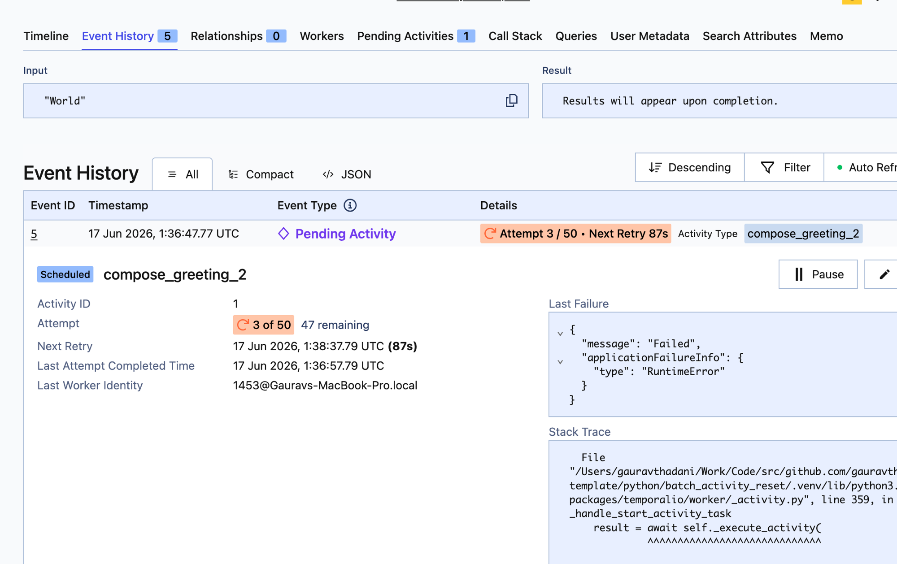
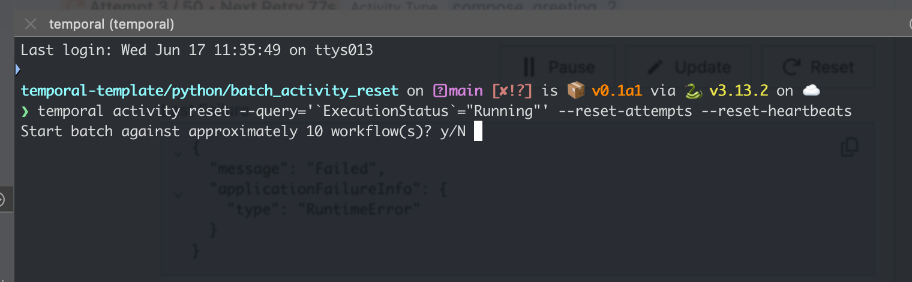
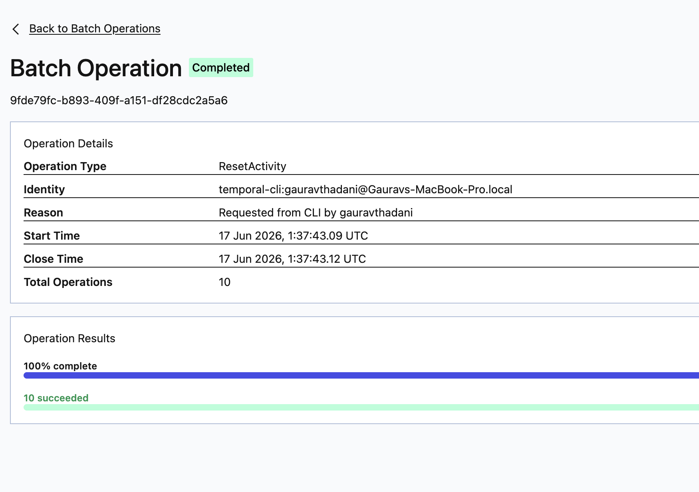
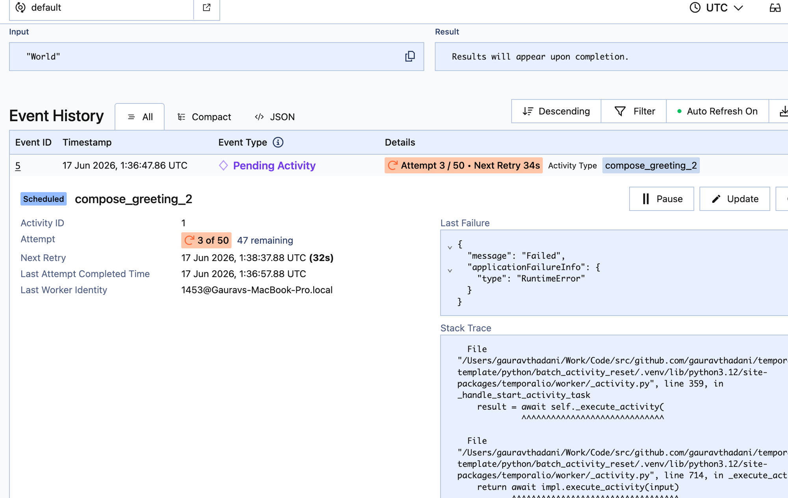

# batch_activity_reset

## Run

Install dependencies:

```bash
uv sync
```

Start Temporal local:

```bash
temporal server start-dev
```

Run worker:

```bash
uv run -m hello_worker.worker
```

Run starter:

```bash
uv run -m hello_worker.hello_activity_async
```

Activities fail and enter retry backoff (attempt 3 / 50):



## Issue

Run the batch reset against running workflows:

```bash
temporal activity reset --query='`ExecutionStatus`="Running"' --reset-attempts --reset-heartbeats
```



The batch operation reports success (10 succeeded):



But the activity attempt count is unchanged — still attempt 3 / 50, not reset to 1:


