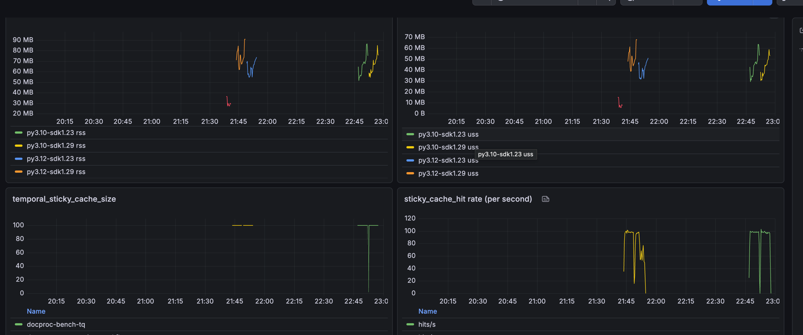

# temporalio 1.23 → 1.29 + Python 3.10 → 3.12 — reproduction report

## Goal

Test whether the `temporalio` 1.23 → 1.29 upgrade, combined with Python
3.10 → 3.12, produces a memory leak or unbounded growth on a sandboxed
workflow that could account for a reported memory cliff — pods sitting at
low-single-GiB working set jumping several GiB in a couple of minutes at
sticky cache sizes as low as 5–20.

## Setup

- Fresh project running a 4-activity `document_processing` pipeline
  (`classify → extract → chunk_embed → index`), sandboxed workflow
  runner (`SandboxedWorkflowRunner`), lean workflow definition.
- `uv`-managed venvs per (Python × SDK) combination:
  - py3.10 / 1.23, py3.10 / 1.29, py3.12 / 1.23, py3.12 / 1.29.
- Local Temporal dev server (`temporal server start-dev`).
- **Cache size verified via SDK metrics** (`temporal_sticky_cache_size`,
  `temporal_sticky_cache_hit`) — not just the nominal
  `max_cached_workflows` argument. This matters because RSS alone can't
  distinguish "cache is full and churning" from "cache is empty and
  workflows completed".
- Memory measured two ways in parallel:
  - `psutil.Process(pid).memory_info().rss` sampled every 1 s.
  - Custom `worker_rss_bytes` / `worker_uss_bytes` Prometheus gauges
    published from the same worker (Prometheus at `localhost:9090`,
    Grafana at `localhost:3000`).
- OS: macOS. Absolute RSS is not directly comparable to Linux
  containers — only *shapes* and *deltas* transfer.

## Tests run

### Test 1: cache pressure (evictions active)

Config: `max_cached_workflows=20`, 40 open long-lived workflows, each
signaled every 1 s for 120 s. This forces continuous eviction and
re-hydration (~half of the workflows are evicted at any time).

| combo         | baseline (MiB) | peak (MiB) | growth (MiB/min) |
|---------------|----------------|------------|------------------|
| py3.10 / 1.23 | 67.3           | 115.3      | 21.9             |
| py3.10 / 1.29 | 62.4           | 125.7      | 28.7             |
| py3.12 / 1.23 | 54.6           | 120.1      | 29.9             |
| py3.12 / 1.29 | 56.8           | 128.5      | 32.7             |

- Python 3.10 → 3.12 alone adds ~36 % to growth rate (21.9 → 29.9).
- 1.23 → 1.29 alone adds ~31 % to growth rate (21.9 → 28.7).
- Both combined: +49 %. Roughly additive, not multiplicative.
- All curves are **linear** and flatten immediately when signals stop.
  Bounded, not runaway. No cliff.

### Test 2: no eviction (all workflows resident)

Config: `max_cached_workflows=500`, 100 open long-lived workflows, each
signaled every 1 s for 300 s, workflows left running (no shutdown).
`temporal_sticky_cache_size` remained at 100 for the entire run; every
signal was a cache hit (no rehydration).

Full 2×2 matrix at this config:

| combo         | baseline (MiB) | p50   | p90   | peak  | peak USS |
|---------------|----------------|-------|-------|-------|----------|
| py3.10 / 1.23 | 48.7           | 64.3  | 81.5  | 82.6  | 60.8     |
| py3.10 / 1.29 | 54.0           | 63.9  | 74.9  | 84.6  | 60.7     |
| py3.12 / 1.23 | 55.3           | 60.4  | 68.5  | 70.3  | 48.7     |
| py3.12 / 1.29 | ~70            | 69.8  | 86.2  | 86.9  | 64.8     |

Sticky cache size stayed at 100 in all four runs; hit rate was
83–98 hits/s (every signal a cache hit, no rehydration).

**Actual upgrade path (py3.10/1.23 → py3.12/1.29):**

| metric        | 1.23 / 3.10 | 1.29 / 3.12 | Δ           |
|---------------|-------------|-------------|-------------|
| p50 RSS       | 64.3        | 69.8        | +5.5 MiB (+8.6 %)  |
| p90 RSS       | 81.5        | 86.2        | +4.7 MiB (+5.8 %)  |
| peak RSS      | 82.6        | 86.9        | +4.3 MiB (+5 %)    |
| peak USS      | 60.8        | 64.8        | +4.0 MiB (+6.6 %)  |

**Attribution (single-variable rows):**

- Python 3.10 → 3.12 with the same SDK (1.23): p50 64.3 → 60.4, peak
  82.6 → 70.3 — 3.12 actually runs a bit *cooler* than 3.10 on this
  lean workflow, likely because CPython's arena/allocator tuning
  changed between versions.
- 1.23 → 1.29 with the same Python (3.10): p50 64.3 → 63.9, peak
  82.6 → 84.6 — essentially indistinguishable from noise.

**Caveat**: single run per combo, 5 min each. Sawtooth amplitude on
these traces is ~20 MiB, so single-digit-percent differences between
combos are inside run-to-run noise. Reproducing each cell ≥3× and
reporting a mean/CI would be a stronger claim; the finding here is that
the endpoint delta is *small* — not that any specific ordering is
significant.

All four RSS traces are **sawtooth** — memory is reclaimed on each
cycle (dropped 18–20 MiB in the middle of every run before climbing
again). No unbounded growth.



*All four combos in one view. RSS panel (top left) and USS panel (top
right) — earlier cluster around 21:45 is the py3.12 pair (blue =
py3.12/1.23, orange = py3.12/1.29); later cluster around 22:45 is the
py3.10 pair (green = py3.10/1.23, yellow = py3.10/1.29). Every trace is
a healthy sawtooth with memory reclaimed on each cycle — no
unbounded growth in any combo. Bottom left: `temporal_sticky_cache_size`
pinned at 100 for every run (all workflows resident, no evictions).
Bottom right: cache hit rate ≈ signal rate — every reactivation served
from cache.*

## Interpretation

1. **No memory leak in either the eviction or no-eviction case.** All
   four combos in Test 2 trace healthy sawtooths — memory is reclaimed
   between cycles, no drift over 5 minutes. Test 1's eviction-heavy run
   shows bounded linear growth that flattens the instant signals stop.

2. **The full-upgrade delta (py3.10/1.23 → py3.12/1.29) is small on a
   lean workflow.** p50 +5.5 MiB, peak +4.3 MiB, USS peak +4 MiB.
   Sample size is one 5-min run per combo, so single-digit-percent
   differences are inside noise. What is *clear* is that the endpoint
   delta is small — not multi-GiB, not a leak, not a cliff.

3. **The reported cliff can't be explained by the raw combo.**
   Multi-GiB working set at sticky cache values in the low single digits
   implies per-cached-instance memory measured in hundreds of MiB —
   roughly 3 orders of magnitude larger than our lean instance. The
   endpoint delta we measure here is small enough that the affected
   workload must contribute a much larger multiplier on top of it.

4. **Candidate amplifiers not reproduced yet:**
   - **Import surface**: a workflow definition that transitively pulls
     many other modules into the sandbox. The SDK's `Importer`
     allocates a fresh `new_modules` dict per workflow instance, so any
     module not in `passthrough_modules` gets a per-instance copy. This
     is where per-instance memory can balloon.
   - **PEP 659 code-object inflation** (Python 3.11+). Inline caches
     enlarge code objects noticeably; the effect multiplies with the
     import graph size.
   - **Workflow instance state size** — our test workflow only retains
     one small response object; a production workflow may retain
     substantially larger state.
   - Something workload-specific triggered mid-traffic (large payload,
     query burst, unusual retention pattern).

## Suggested next steps

Ordered by cost / likelihood of information gain:

1. **Turn off gzip on one prod pod** (`Client.connect(...,
   grpc_compression=GrpcCompression.NONE)`). Ruling this default change
   from 1.29 in or out is a five-minute test.
2. **Bring one canary pod to Python 3.10 with 1.29 installed** (or
   Python 3.12 with 1.23) to isolate which of the two upgrades
   dominates. Our tests show both contribute independently; the ratio
   in the affected environment is the important number.
3. **Run `tracemalloc`** on the worker during a cliff and dump top
   allocations by file. If growth is Python-visible, that localises it
   to a module. If invisible (i.e. accounted only by RSS), it points at
   the Rust core / bridge — PyO3 0.29 upgrade is the largest bridge
   change between 1.23 and 1.29.
4. **Consider `1.30` or `1.31`** on a canary. Neither carries an
   explicitly-labelled memory-leak fix, but they include
   sdk-core#1365 (`Fix/finalize shutdown arc race`) and
   sdk-python#1643 (`Release the GIL during the activity heartbeat core
   call`), both of which harden known retention paths.
5. **Prune the sandbox import surface**: any module reachable from the
   workflow definition graph that is not needed for workflow execution
   itself can be moved to `passthrough_modules`. Every module that moves
   out of the per-instance import cost is a saving multiplied by cache
   size.

## On rolling back workers to 1.23

If OOMs are actively taking down 1.29 pods and rolling back the worker
image feels like the fastest fix — **it is not safe by default** for
workflows that already ran on 1.29 and are still open.

Temporal SDKs are designed for **forward compatibility**, not backward.
Every Workflow Task Completed event in history carries
`sdk_metadata.core_used_flags` / `lang_used_flags` — bitmasks of
internal behavior flags the SDK set during that WFT. If a replay-time
SDK sees a flag bit it doesn't recognize, the SDK fails the WFT rather
than risk silent non-determinism. Same category of risk for command
types, payload encodings, and Nexus-related events added between 1.23
and 1.29. Official Temporal guidance is the same shape: upgrade, not
downgrade.

What "not safe" means concretely:

- Workflows that ran ≥1 WFT on 1.29 and are still open → their next
  activation on a 1.23 worker can fail. Failures loop until WFT timeout
  or the workflow is reset.
- Workflows *started* on 1.23 after the rollback → fine.
- Completed workflows → don't care.

Safer recovery options, ranked:

1. **Deploy 1.23 to a new task queue and drain the old queue.** New work
   goes to 1.23; the 1.29 queue eventually empties as in-flight
   workflows complete. Only works for short-lived workflows.
2. **Continue-as-new all in-flight workflows** before rolling back
   (starts a fresh history that 1.23 owns from event 1). Only viable if
   the workflow code has a CAN path.
3. **Roll back and reset affected runs** via `temporal workflow reset`
   to a pre-1.29 checkpoint. Disruptive but sometimes acceptable for
   idempotent workflows.
4. **Move *forward* to 1.30 or 1.31** instead. They pick up sdk-core
   arc-race and GIL-release fixes without introducing rollback exposure.

Quick pre-flight check on any candidate for rollback:

```
temporal workflow describe -w <wf-id>       # inspect history JSON
```

Look at each `WorkflowTaskCompleted.sdkMetadata.langUsedFlags` /
`coreUsedFlags`. Non-zero bits set on a WFT completed by 1.29 are the
flag exposure — those workflows will not replay cleanly on 1.23.

## What we did NOT reproduce

- **The cliff shape** (steady baseline → multi-GiB in ~2 min). All RSS
  traces here are healthy sawtooth with linear or bounded envelopes.
- **Multi-GiB memory usage** on a lean workflow. Everything above stays
  under 130 MiB.

If the reproducer is useful to push further, the highest-leverage
extension is an import-surface variant (a registry that transitively
pulls ~30 workflow classes with realistic types), rerun head-to-head at
the affected cache sizes.

## How to reproduce

```bash
temporal server start-dev &                            # local server on :7233
./scripts/run_combo.sh 3.12 1.29.0 100 500 300 1       # py + sdk + workflows + cache + duration + interval
./scripts/run_combo.sh 3.12 1.23.0 100 500 300 1
```

Metrics are on `http://localhost:8079/metrics` while the worker runs and
persisted in Prometheus at `localhost:9090` (Grafana at `localhost:3000`,
filter by `combo` label).

## Environment

- Python 3.10.17, 3.12.11 (uv-managed).
- `temporalio` 1.23.0 and 1.29.0 from PyPI.
- Sandboxed workflow runner (`SandboxedWorkflowRunner`).
- Local Temporal dev server (`temporal server start-dev`).
- Prometheus + Grafana stack running in Docker.
- macOS Darwin.
